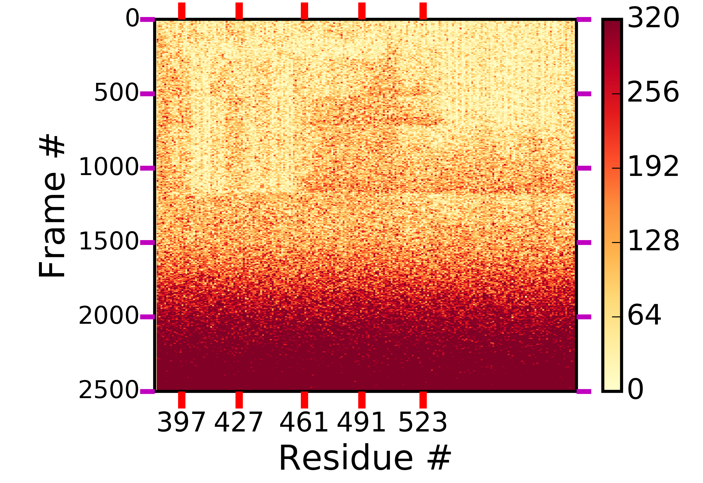
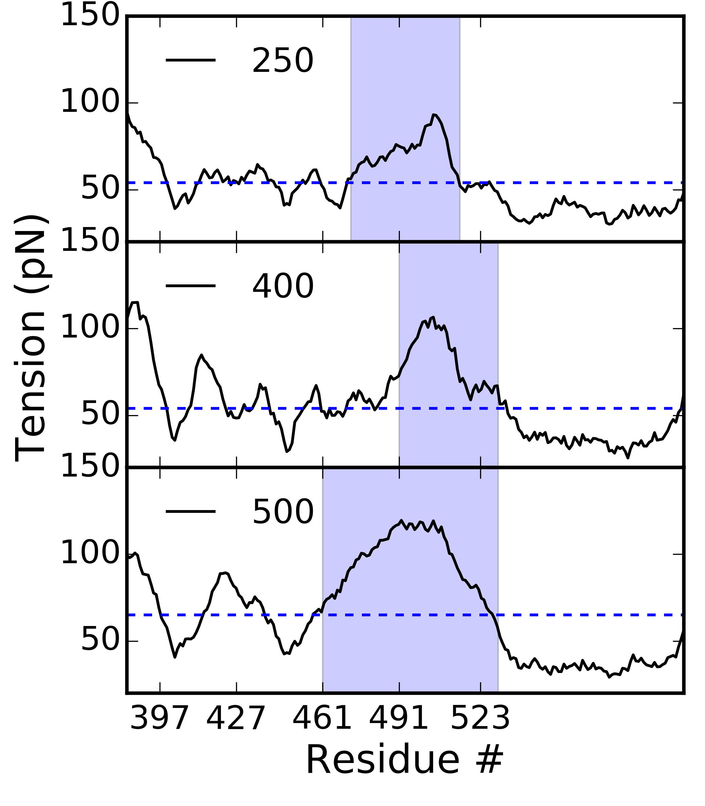
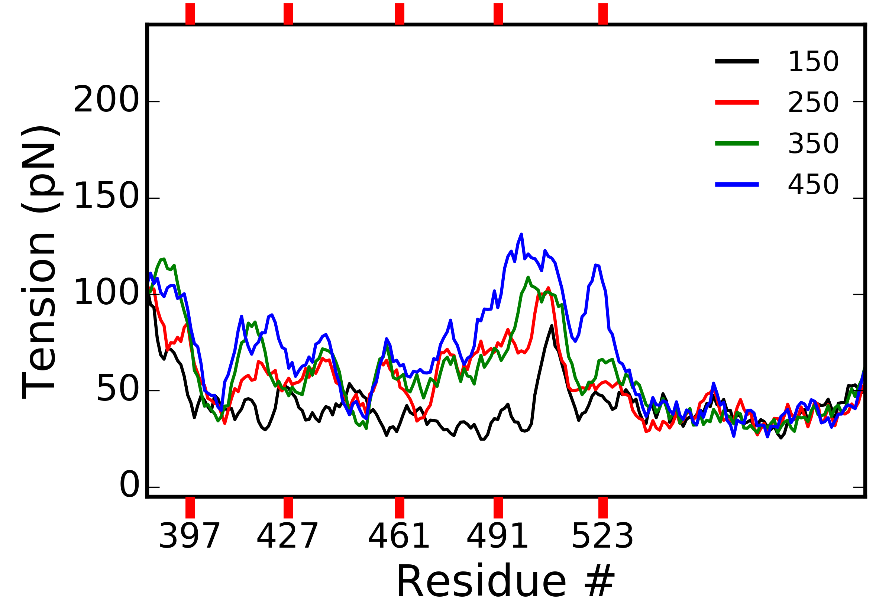
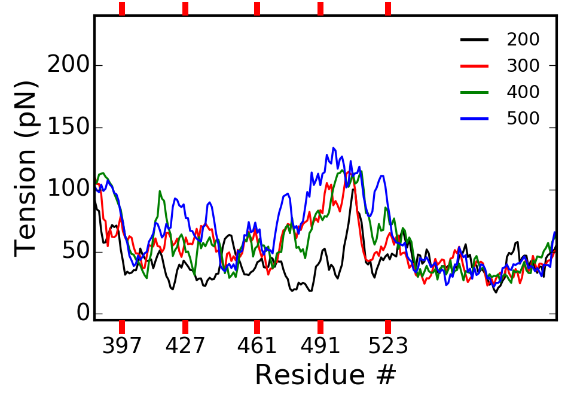
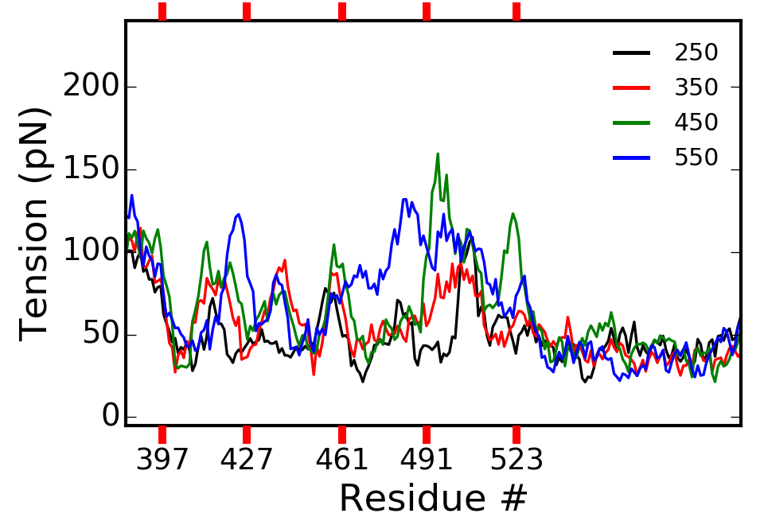
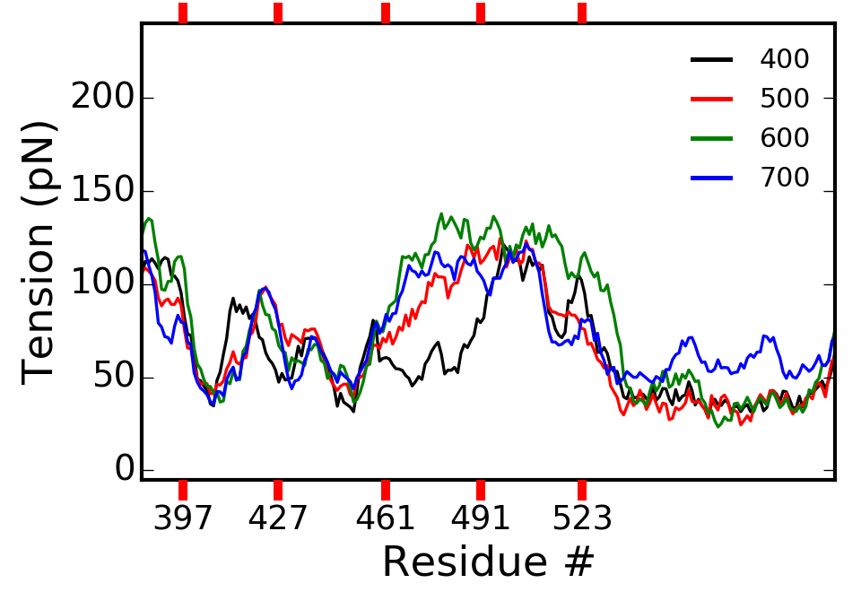
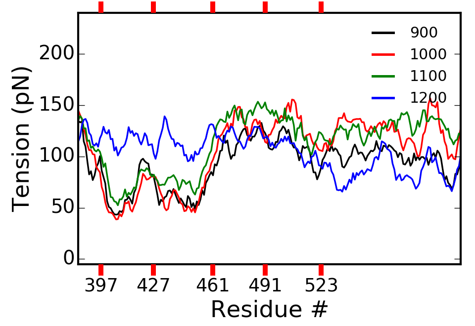

# Segment Analysis for Coarse-grained Molecular Dynamics in the SOP model
The self-organized polymer (SOP) model is a coarse-grained molecular dynamics software that
employs Brownian motion for the dynamics describing macromolecular structures. It uses a finite-extensible
non-linear elastic potential for the covalent bonds, a Lennard-Jones potential for non-covalent native contacts,
and the repulsive part of the Lennard-Jones potential for non-covalent non-native contacts. Due to the size of the
macromolecular structures and the corresponding trajectories acquired using the SOP model, certain scripting languages
are not fast enough or capable of holding in memory the necessary information to perform routine analyses.
Therefore, Segment Analysis was written to facilitate the analysis of these structures and their dynamics.

## Quickstart:
Create a bin directory if it does not yet exist. Then run:

    mkdir -p bin
    make all

After creating all of the executables, consider copying them to /usr/local/bin/.

    sudo cp bin/run_segment* /usr/local/bin

### The quickstart targets:
Compiling all of the softwares available is a quick way to get started. See the [Makefile](./Makefile).
The following softwares will be compiled (target:executable). $(EXEC) is usually run_segment.
* dimermap_release:
    * bin/$(EXEC)_dcd_dimermap_mt
* indices_release:
    * bin/$(EXEC)_index
* topology_release:
    * bin/$(EXEC)_top
* write_dcd_release:
    * bin/$(EXEC)_dcd_write
* costension_release:
    * bin/$(EXEC)_dcd_costension_1
* curva_mod_release:
    * bin/$(EXEC)_dcd_curva4_pfm
* curva_mod3_release:
    * bin/$(EXEC)_dcd_curva3_pfm
* anglec_release:
    * bin/$(EXEC)_dcd_anglec_mt
    * bin/$(EXEC)_dcd_anglec_pf
* cenmov_release:
    * bin/$(EXEC)_dcd_cenmov_mt
* contactmapM_release:
    * bin/$(EXEC)_dcd_contactmap_mt
* contactmapP_release:
    * bin/$(EXEC)_dcd_contactmap_pf
* contactmapN_release:
    * bin/$(EXEC)_dcd_contactmap_1
* dcd_release:
    * bin/$(EXEC)_dcd
* chi_release:
    * bin/$(EXEC)_dcd_chi_1

## How to run:
Assuming you copied the executables to /usr/local/bin, you are now ready to run analysis on your SOP trajectories.
*(if not, then use an export command to expand your $PATH variable to include the segment_analysis-master/bin directory)*

To run, it's the executable, followed by the pdb and dcd. Then input the # of chains/segments in the molecule, the # of chains and segments in the molecule
to ignore, and finally a start, stop, and step integers for the frames to be evaluated. Input all of this on 1 line.

    run_segment_dcd_contactmap_mt <PDB> <DCD> <num_chains> <chains_ignore> <start> <stop> <step>
    run_segment_dcd_contactmap_mt mt.ref.pdb dcd/mt_D1_pull.dcd 157 1 0 25000 10

If you run one of the softwares incorrectly, you'll receive this message:

    Welcome to the segmental/chain analyzer!
    chain allocation size is: 664
    chain allocation size is(mt): 664
    Usage: ./run_segment_dcd_contactmap_mt <Filename-reference-PDB> <Filename-timelater-DCD> <num_chains> <chains_ignore> <start> <stop> <step>

Try again.

## Plotting examples:
The output should be reasonably easy to plot if you are familiar with array manipulations using numpy or something equivalent.

### Tension:
Figure of the tension in the Hsp70 substrate binding domain:

