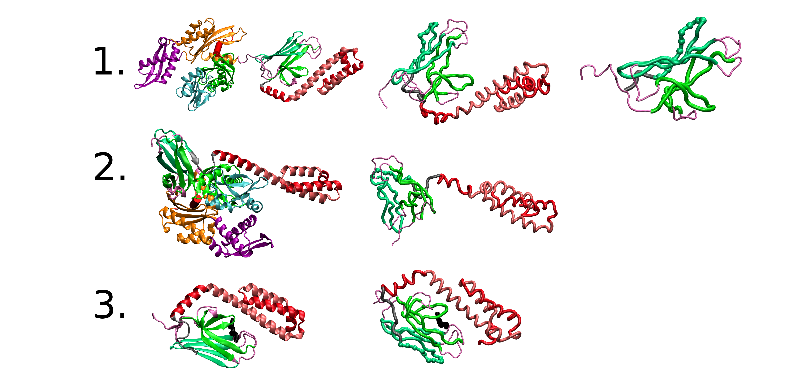
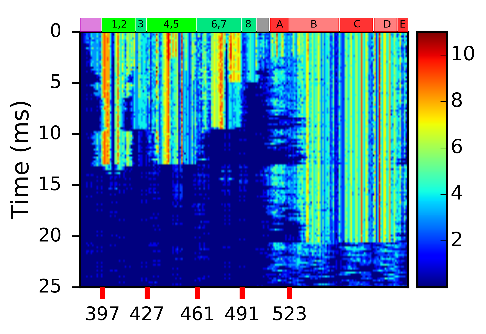
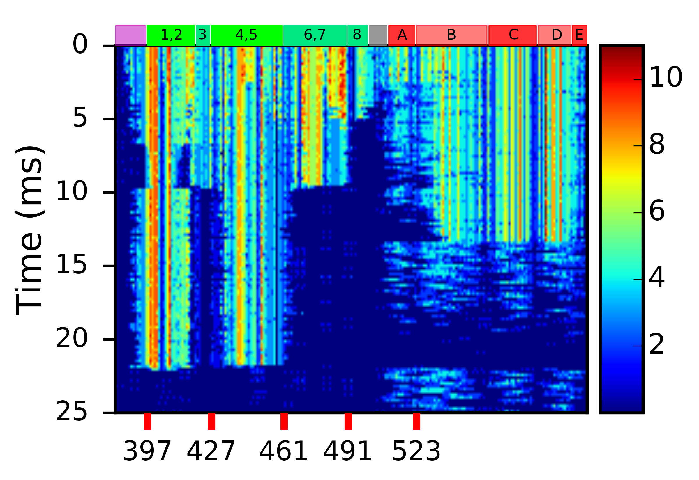

# Segment Analysis for Coarse-grained Molecular Dynamics in the SOP model
The self-organized polymer (SOP) model is a coarse-grained molecular dynamics software that
employs Brownian motion for the dynamics describing macromolecular structures. It uses a finite-extensible
non-linear elastic potential for the covalent bonds, a Lennard-Jones potential for non-covalent native contacts,
and the repulsive part of the Lennard-Jones potential for non-covalent non-native contacts. Due to the size of the
macromolecular structures and the corresponding trajectories acquired using the SOP model, certain scripting languages
are not fast enough or capable of holding in memory the necessary information to perform routine analyses.
Therefore, Segment Analysis was written to facilitate the analysis of these structures and their dynamics.

## Quickstart:
Create a bin directory if it does not yet exist. Then run:

    mkdir -p bin
    make all

After creating all of the executables, consider copying them to /usr/local/bin/.

    sudo cp bin/run_segment* /usr/local/bin

### The quickstart targets:
Compiling all of the softwares available is a quick way to get started. See the [Makefile](./Makefile).
The following softwares will be compiled (target:executable). $(EXEC) is usually run_segment.
* dimermap_release:
    * bin/$(EXEC)_dcd_dimermap_mt
* indices_release:
    * bin/$(EXEC)_index
* topology_release:
    * bin/$(EXEC)_top
* write_dcd_release:
    * bin/$(EXEC)_dcd_write
* costension_release:
    * bin/$(EXEC)_dcd_costension_1
* curva_mod_release:
    * bin/$(EXEC)_dcd_curva4_pfm
* curva_mod3_release:
    * bin/$(EXEC)_dcd_curva3_pfm
* anglec_release:
    * bin/$(EXEC)_dcd_anglec_mt
    * bin/$(EXEC)_dcd_anglec_pf
* cenmov_release:
    * bin/$(EXEC)_dcd_cenmov_mt
* contactmapM_release:
    * bin/$(EXEC)_dcd_contactmap_mt
* contactmapP_release:
    * bin/$(EXEC)_dcd_contactmap_pf
* contactmapN_release:
    * bin/$(EXEC)_dcd_contactmap_1
* dcd_release:
    * bin/$(EXEC)_dcd
* chi_release:
    * bin/$(EXEC)_dcd_chi_1

## How to run:
Assuming you copied the executables to /usr/local/bin, you are now ready to run analysis on your SOP trajectories.
*(if not, then use an export command to expand your $PATH variable to include the segment_analysis-master/bin directory)*

To run, it's the executable, followed by the pdb and dcd. Then input the # of chains/segments in the molecule, the # of chains and segments in the molecule
to ignore, and finally a start, stop, and step integers for the frames to be evaluated. Input all of this on 1 line.

    run_segment_dcd_contactmap_mt <PDB> <DCD> <num_chains> <chains_ignore> <start> <stop> <step>
    run_segment_dcd_contactmap_mt mt.ref.pdb dcd/mt_D1_pull.dcd 157 1 0 25000 10

If you run one of the softwares incorrectly, you'll receive this message:

    Welcome to the segmental/chain analyzer!
    chain allocation size is: 664
    chain allocation size is(mt): 664
    Usage: ./run_segment_dcd_contactmap_mt <Filename-reference-PDB> <Filename-timelater-DCD> <num_chains> <chains_ignore> <start> <stop> <step>

Try again.

## Plotting examples:
The output should be reasonably easy to plot if you are familiar with array manipulations using numpy or something equivalent.
The following examples were used in my research on the Heat shock protein (70 kDa) nucleotide binding domain and substrate
binding domain. Those two papers, published in the Proceedings of the National Academy of Sciences, are linked to here:
* [doi: 10.1073/pnas.1619843114](http://www.pnas.org/content/112/33/10389.abstract) on NBD (2015).
* [doi: 10.1073/pnas.1504625112](http://www.pnas.org/content/114/23/6040) on SBD (2017).

### Hsp70: the nucleotide binding domain (NBD) and the substrate binding domain (SBD):
Figure of the Hsp70:

The starting structures:
1. [2KHO:](http://www.rcsb.org/pdb/explore.do?structureId=2KHO) NMR-RDC / XRAY structure of E. coli HSP70 (DNAK) chaperone (1-605) complexed with ADP and substrate.
2. [4B9Q:](http://www.rcsb.org/pdb/explore.do?structureId=4B9Q) Open conformation of ATP-bound Hsp70 homolog DnaK
3. [4EZW:](http://www.rcsb.org/pdb/explore.do?structureId=4EZW) Crystal structure of the substrate binding domain of E.coli DnaK in complex with the designer peptide NRLLLTG.

### Tension:
Figure of the tension in the Hsp70 substrate binding domain:

 
 
 

The global tension is depicted in the upper left plot. It is essentially a heat map of outputted data file generated by run_segment_dcd_costension_1.
In the four lower tension plots, we have time resolution in how tension becomes distributed in the constituent parts of the SBD. For example, in the upper right
(but still of the lower 4 plots), depicting frames 250 - 550, (ordering is black, red, green, blue) we see tension begin in the connecting loop between the beta-sandwich and the
alpha-helical lid (residues 501-510); next, tension builds up in beta-strand 8 (residues down to 491), followed by tension buildup in Helix A and partial Helix B (over to residues 533);
finally, tension breaks off beta-6,7 (residues 461-491) while permitting partial refolding of Helix A and B (resiudes 510-533).

### Contacts:
Figure of the contact evolution for Hsp70, substrate binding domain:

 

On the left, we have a contact map showing beta-sandwich domain breaking apart first (at 10-13 ms). On the right, we have a contact map showing
the alpha-helical lid breaking apart before the beta-core (beta-strands 1-5).

## Final Comments/Future development:
This project was mainly written in C, in that the data tracking was performed using arrays. A related project,
[emolsion](https://github.com/dmerz75/emolsion), is more C++ based, uses a lot more std::vector's. Most analyses developed in the
future would likely start there.

More description of the curvature and centroid movement, particularly as it applies to the protofilament bending project may be added soon.

## Notes/ Disclaimer/ Acknowledgements:
Six header files are not mine. They are currently used because I believe permission was given
provided the copyrights were retained and credit/notice given. They are:

* [Zed A. Shaw's] (https://learncodethehardway.org/c/) awesome debug macros.
  * debug.h
* These 5 headers are from UIUC, for use with their proprietary 'dcd' format. Information is
provided [here.] (http://www.ks.uiuc.edu/Research/vmd/plugins/doxygen/files.html)

        (C) Copyright 1995-2006 The Board of Trustees of the
                        University of Illinois
                         All Rights Reserved

  * dcdio.h ([dcdplugin.h](http://www.ks.uiuc.edu/Research/vmd/plugins/doxygen/dcdplugin_8c.html))
  * [endianswap.h] (http://www.ks.uiuc.edu/Research/vmd/plugins/doxygen/endianswap_8h.html)
  * [fastio.h] (http://www.ks.uiuc.edu/Research/vmd/plugins/doxygen/fastio_8h.html)
  * [largefiles.h] (http://www.ks.uiuc.edu/Research/vmd/plugins/doxygen/largefiles_8h.html)
  * [molfile_plugin.h] (http://www.ks.uiuc.edu/Research/vmd/plugins/doxygen/molfile__plugin_8h.html)

* Some of the coordinates in the test directory are straight from the [PDB] (http://www.rcsb.org/).
  * [2KHO.pdb] (http://www.rcsb.org/pdb/explore.do?structureId=2kho)
